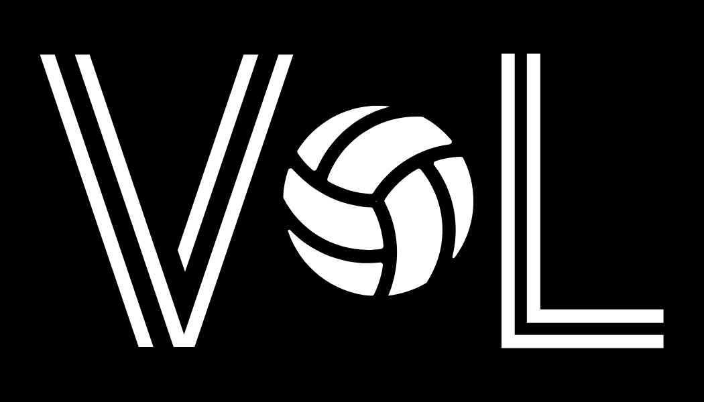

<h1 align="center">
  <a href="https://volleylineup.com" target="_blank">
    
    </img>
  </a>
</h1>

<h3 align="center">Lead Your Volleyball Team To Victory!</h3>

  
  
  

 

## Introduction
Welcome to **Volley Lineup**: A mobile web application to help you lineup your volleyball team for an optimal rotation.

## Getting Started
Please visit https://volleylineup.com to get started. 

## Creator

  Michael Lam
  
  </a>
    

## Licenses
MIT